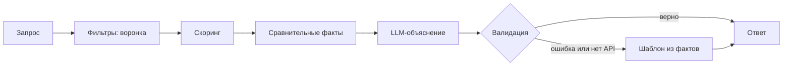

# BIMteam — «Точно к месту»

Мы не сортируем каталог — мы объясняем выбор. Даже когда выбора нет.

## Демо за 60 секунд

Нужны Git, **Python 3.11+** и доступ к закрытому репозиторию. Без ключей сервис работает на шаблонных объяснениях. Первая загрузка зависимостей может занять больше минуты; повторный запуск — без установки Python. Node.js не нужен.

Новый бэкенд находится в ветке `abzal/filters`; `main` обновится после принятия PR командой.

Windows / PowerShell — три команды:

```powershell
git clone --branch abzal/filters https://github.com/BAITC-Hacks/hack-873d221c-bimteam.git
cd hack-873d221c-bimteam
powershell -NoProfile -ExecutionPolicy Bypass -File scripts/start.ps1
```

macOS / Linux — три команды:

```sh
git clone --branch abzal/filters https://github.com/BAITC-Hacks/hack-873d221c-bimteam.git
cd hack-873d221c-bimteam
sh scripts/start.sh
```

Скрипт создаёт `.venv`, устанавливает зависимости и открывает [сайт](http://127.0.0.1:8000/) после готовности сервера. Оставьте терминал открытым; остановка — Ctrl+C. Если браузер не открылся, перейдите по ссылке вручную. Не открывайте HTML двойным кликом.

Если `py` не найден или `python` показывает 2.6, установите Python 3.11+ с [python.org](https://www.python.org/downloads/), включите **Add Python to PATH**, затем откройте новый терминал. Скрипт проверяет версию и не использует Python 2.6. Для Linux может потребоваться системный пакет `python3-venv`.

Без Git: [скачать эту версию сайта и сервера ZIP-архивом](https://github.com/BAITC-Hacks/hack-873d221c-bimteam/archive/refs/heads/abzal%2Ffilters.zip), распаковать, открыть PowerShell в папке с README и выполнить третью команду. Для закрытого репозитория сначала войдите в GitHub. [Общая ветка main](https://github.com/BAITC-Hacks/hack-873d221c-bimteam/tree/main) может содержать предыдущую версию.

## Что делает сервис

Вход: город, дата, формат мероприятия, категория, бюджет; дополнительно язык, часы и пожелания. Выход: до трёх свободных подрядчиков с объяснениями, происхождением данных, воронкой и проверенными подсказками. Пожелания не отменяют обязательных условий.

Три исхода ниже — сокращённые проекции **реальных ответов** из [demo_queries.json](data/demo_queries.json), сценарии 3, 4 и 5. Полные ответы там же; изменяющийся `elapsed_ms` исключён только из сохранённых снимков.

```json
{"status":"found","message":"Подходящих профилей: 1; показано: 1. В каталоге для «Флорист» и города Астана профилей всего: 1.","cards":[{"id":"HK-90002","name":"Хаку"}]}
```

```json
{"status":"no_category","message":"Категории «Декоратор» в городе Астана нет. Профили этой категории есть в других городах: Алматы: 3.","cards":[]}
```

```json
{"status":"all_filtered","message":"Из 10 профилей «Ведущий» в городе Алматы не подошёл ни один: 5 — не берут формат «конференция»; 4 — заняты 05.12.2026; 1 — дороже 250 000 ₸.","cards":[]}
```

## Как это устроено внутри



**Запрос.** Pydantic проверяет дату в окне 23.09–31.12.2026, положительный целый бюджет, допустимые значения справочников и необязательные поля. Ошибка — HTTP 422 с русским сообщением.

**Фильтры.** Последовательность: категория+город → формат → дата → бюджет → язык → длительность. Последние два шага появляются только при заданном ограничении. Каждый исключённый ID учитывается ровно один раз. `max_hours=null` означает, что ограничение присутствия неприменимо.

**Скоринг.** Только прошедшие кандидаты получают балл. Код сортирует по `(-round(score, 6), id)` и выбирает первые три. LLM не может добавить человека, поменять порядок или пропустить занятого.

**Факты.** Сравниваем цену и языки со всей подходящей группой, часы — с другими выбранными карточками. Уникальность утверждается только без ничьей. Добавляем точную цитату ≤12 слов. Один факт занятости использует всю группу «категория+город»; его счётчик может отличаться от шага даты, где уже применён фильтр формата.

**LLM.** Один batch со всеми выбранными ID и фактами через общий OpenAI SDK. OpenAI — основной вариант; NVIDIA выбирается явно как альтернативный провайдер. Автоматического переключения между платными провайдерами нет. В норме один запрос; при неверном JSON/объяснении разрешена одна корректирующая попытка. Обе вместе ограничены 8 секундами, скрытые повторы SDK отключены.

**Валидация.** Проверяем полноту и уникальность ID, длину ≤280 символов, 1–2 предложения, минимум два факта и одно число, все числа по источнику, запрещённые фразы и Jaccard <0.5 между карточками. Дополнительная консервативная защита: факты цитируются целиком, между ними разрешены только связки. Проверка одних чисел не поймала бы выдуманное «самый опытный».

**Шаблон.** Без модели, при ошибке сети, таймауте или неверном ответе код выбирает два отличающих факта. Текст и источник `llm/template` сохраняются в файловом кэше; fallback тоже сохраняется, поэтому внезапное восстановление сети не меняет повторный ответ.

**Ответ.** Сервер добавляет причину короткой выдачи, до двух подсказок и время. Каждая подсказка заново проверяет тот же фильтр с изменением ровно одного условия. Журнал содержит одну строку результата без ключей, пожеланий и текстов профилей.

## Почему так

- LLM не ранжирует: жёсткие ограничения и выбранный порядок можно воспроизвести и проверить тестом.
- Один batch на три карточки позволяет учитывать различия между ними и не умножать обычную задержку на три.
- Детерминизм обеспечивают сортировка с ID, фиксированные веса и кэш по провайдеру, модели, версии промпта, нормализованному запросу и фактам. Одинаковые одновременные запросы объединяются внутри одного процесса.
- На 66 записях нет оснований дообучать модель: нет размеченных хороших/плохих рекомендаций и контрольной выборки.
- Защита от выдумок проверяет и числа, и происхождение целых утверждений. Цитата остаётся заявлением из профиля, не независимым подтверждением опыта.
- Семантика опциональна: описания считаются заранее; без совместимых файлов или ключа сервис использует нулевую смысловую добавку и продолжает работать.

## Формула скоринга

`score = Σ WEIGHTS[k] × feature[k]`. Веса — в одном словаре [app/scoring.py](app/scoring.py).

| Признак | Вес | Значение |
| --- | ---: | --- |
| budget_fit | 0.30 | `max(0.4, price / budget)`; среди прошедших цена не выше бюджета |
| format_focus | 0.25 | `0.5 × (формат первый) + 0.5 / число форматов` |
| language_bonus | 0.10 | 0.8 за запрошенный совпавший язык + 0.2 за несколько языков |
| duration_margin | 0.10 | `min(1, (max_hours − hours) / hours)`; 0 без запроса/лимита |
| semantic | 0.25 | косинус, ограниченный [0,1]; 0 без индекса |
| synthetic_penalty | −0.03 | 1 для synthetic, иначе 0 |
| imputed_penalty | −0.02 | 1 для price_imputed, иначе 0 |

Цена ближе к бюджету получает больше баллов, но дешёвый профиль сохраняет минимум 0.4 по этому признаку. Это **эвристика ожидаемого ценового сегмента**, а не доказательство качества или обещание, что дорогой лучше. Порядок форматов в исходных данных тоже не подтверждает профессиональную специализацию; в фактах сообщается только список из каталога.

Чтобы изменить веса, отредактируйте `WEIGHTS`, пересоздайте демо и запустите тесты. При отсутствии семантики остальные веса не перенормируются. При равенстве округлённого балла порядок задаётся ID.

## Работа с данными

[contractors.csv](data/contractors.csv): 66 анонимизированных профилей, UTF-8-SIG, списки через `|`. Из них 13 synthetic, 18 price_imputed, 8 city_imputed; у 9 не задан max_hours. Цена «от» — не окончательная стоимость и не бронь.

| Флаг | Значение | Где виден |
| --- | --- | --- |
| synthetic | Синтетический профиль организаторов | Карточка API и подпись в интерфейсе |
| price_imputed | Цена проставлена при подготовке | Карточка API и отдельная подпись |
| city_imputed | Город проставлен при подготовке | Карточка API и отдельная подпись |

**Мы не добавляли новых синтетических профилей.** Загрузчик поддерживает необязательный `data/contractors_extra.csv`: тот же формат, только synthetic=True, уникальные ID. Ошибки формата/дат/дубликатов останавливают запуск, а не молча искажают каталог. Старый строительный CSV в `data/legacy/` не загружается.

Эмбеддинги не включены в репозиторий: их нужно явно построить со своим ключом. Метаданные содержат ID, модель, провайдера и хеш описаний; несовместимый индекс игнорируется. NVIDIA-режим рассчитан на модели с `input_type=query/passage`, например семейство [NV-EmbedQA](https://docs.api.nvidia.com/nim/reference/nvidia-nv-embedqa-e5-v5-infer). Выбор доступной модели и право передавать ей данные проверьте в своём проекте.

## Демо-сценарии

Сценарии найдены перебором, а не подобраны по выдуманным ответам. Во всех пяти формат — **конференция**; язык/часы не ограничены.

| № | Запрос | Что доказывает | Ожидаемый статус |
| --- | --- | --- | --- |
| 1 | Алматы, Ведущий, 10.10.2026, 1 300 000 ₸ | 4 подходят, 3 показаны; ранжирование | found |
| 2 | Те же условия, 07.11.2026 | Сон Гоку заменяется Куррапикой из-за календаря | found |
| 3 | Астана, Флорист, 10.10.2026, 300 000 ₸ | Один профиль, честная короткая выдача | found |
| 4 | Астана, Декоратор, 10.10.2026, 1 300 000 ₸ | Категории нет; названы другие города | no_category |
| 5 | Алматы, Ведущий, 05.12.2026, 250 000 ₸ | Причины отсева и действительная подсказка бюджета | all_filtered |

Запустите сервер, откройте **второй терминал в корне репозитория**. Windows — используйте `curl.exe`, а не псевдоним PowerShell `curl`:

```powershell
curl.exe -sS -H "Content-Type: application/json" --data-binary "@data/demo_requests/1.json" http://127.0.0.1:8000/api/recommend
curl.exe -sS -H "Content-Type: application/json" --data-binary "@data/demo_requests/2.json" http://127.0.0.1:8000/api/recommend
curl.exe -sS -H "Content-Type: application/json" --data-binary "@data/demo_requests/3.json" http://127.0.0.1:8000/api/recommend
curl.exe -sS -H "Content-Type: application/json" --data-binary "@data/demo_requests/4.json" http://127.0.0.1:8000/api/recommend
curl.exe -sS -H "Content-Type: application/json" --data-binary "@data/demo_requests/5.json" http://127.0.0.1:8000/api/recommend
```

macOS/Linux: те же пять команд с `curl` вместо `curl.exe`. Файлы запросов UTF-8 исключают проблемы экранирования кириллицы в PowerShell.

Рабочие команды после установки (из корня):

| Задача | Windows | macOS/Linux |
| --- | --- | --- |
| run | `.\.venv\Scripts\python.exe -m uvicorn app.main:app --no-access-log` | `.venv/bin/python -m uvicorn app.main:app --no-access-log` |
| test | `.\.venv\Scripts\python.exe -m pytest -q` | `.venv/bin/python -m pytest -q` |
| demo | `.\.venv\Scripts\python.exe scripts/find_demo_queries.py` | `.venv/bin/python scripts/find_demo_queries.py` |
| embeddings | `.\.venv\Scripts\python.exe scripts/build_embeddings.py` | `.venv/bin/python scripts/build_embeddings.py` |
| warm | `.\.venv\Scripts\python.exe scripts/warm_cache.py` | `.venv/bin/python scripts/warm_cache.py` |

`demo` всегда работает без сети и перезаписывает только демо-файлы. `embeddings` и `warm` при настроенном провайдере расходуют его API-квоту. Перезапустите сервер после смены данных, индекса или `.env`. Полные сценарии доступны через [GET /api/demo](http://127.0.0.1:8000/api/demo).

## Проверка Definition of Done

- [x] 66 исходных профилей, флаги, даты, дополнительные файлы — [test_data.py](tests/test_data.py).
- [x] Жёсткие условия, мультикатегории, границы бюджета/часов, независимый отсев — [test_filters.py](tests/test_filters.py).
- [x] Стабильный порядок, tie-break по ID, честные сравнения — [test_scoring.py](tests/test_scoring.py).
- [x] Запрещённые фразы, чужие числа/ID/свойства, Jaccard, fallback и кэш — [test_explain.py](tests/test_explain.py).
- [x] Подсказки меняют только одно условие и действительно улучшают выдачу — [test_hints.py](tests/test_hints.py).
- [x] Повтор запроса, смена даты, отсутствие занятых, три статуса, короткая выдача, <10 с без сети — [test_api_dod.py](tests/test_api_dod.py).
- [x] SDK-настройки обоих провайдеров и опциональная семантика — [test_llm.py](tests/test_llm.py), [test_semantic.py](tests/test_semantic.py).
- [ ] Проверка реального OpenAI/NVIDIA: с ключом получить `explanation_source=llm`, затем тёплый ответ <300 мс. В этой сборке проверены моки, **не доступ к вашему аккаунту**.

Windows: `.\.venv\Scripts\python.exe -m pytest -q`. В активированном окружении: `pytest`. Тесты не читают ваш `.env`, не требуют ключей и не расходуют API. Установщик можно проверить без браузера: `powershell -NoProfile -ExecutionPolicy Bypass -File scripts/start.ps1 -Check`.

Если Windows сообщает `PermissionError` для общей папки `Temp/pytest-of-abzal`, не меняйте её права и не удаляйте чужие файлы. Используйте отдельную папку внутри проекта и повторите тесты:

```powershell
$env:PYTEST_DEBUG_TEMPROOT = (New-Item -ItemType Directory -Force cache/pytest).FullName
.\.venv\Scripts\python.exe -m pytest -q
```

Workflow GitHub Actions настроен на push/PR для Windows/Python 3.12 и Ubuntu/Python 3.11. **На 23.09.2026 запуск заблокирован GitHub из-за billing issue**, до выполнения тестов. Владельцу аккаунта/организации нужно решить вопрос оплаты; локально 100 тестов прошли. [Отчёт проверки и оставшиеся действия](docs/VERIFICATION.md).

## Конфигурация

Скопируйте [.env.example](.env.example) в `.env`, **только если своего .env ещё нет**, затем отредактируйте локально. Переменные читаются через pydantic-settings из этого файла, не из системного окружения. Ключи не отправляйте в чат, GitHub или frontend.

| Переменная | По умолчанию | Назначение |
| --- | --- | --- |
| LLM_PROVIDER | none | none / openai / nvidia |
| OPENAI_API_KEY | пусто | Ключ проекта OpenAI |
| NVIDIA_API_KEY | пусто | Ключ NVIDIA |
| OPENAI_MODEL | пусто | Доступная chat-модель OpenAI |
| NVIDIA_MODEL | пусто | Доступная chat-модель NVIDIA |
| LLM_TIMEOUT_S | 8 | Общий таймаут попыток, 0 < значение ≤8 с |
| LLM_SEED | не задан | Включать только при поддержке моделью |
| EMBEDDING_PROVIDER | none | Независимо: none / openai / nvidia |
| EMBEDDING_MODEL | пусто | Имя модели векторизации |
| EMBEDDING_TIMEOUT_S | 1 | Таймаут одного вектора запроса, ≤1 с |
| DATA_PATH | data/contractors.csv | Основной CSV |
| EXTRA_DATA_PATH | data/contractors_extra.csv | Необязательные синтетические записи |
| EMBEDDINGS_PATH | data/embeddings.npy | Предрассчитанная матрица |
| EMBEDDINGS_IDS_PATH | data/embeddings_ids.json | ID и метаданные индекса |
| DEMO_PATH | data/demo_queries.json | Сохранённые демо |
| CACHE_DIR | cache | Кэш объяснений и векторов запросов |

Все относительные пути считаются от корня проекта. Прежние `AI_PROVIDER` и `LLM_MODEL` больше не используются: перенесите настройки в `LLM_PROVIDER` и `NVIDIA_MODEL` / `OPENAI_MODEL`.

Для LLM нужна модель с Chat Completions, `temperature=0` и [JSON mode](https://developers.openai.com/api/docs/guides/structured-outputs). Модель не выбирается автоматически по цене/доступности. Нет ключа или имени модели — шаблонный результат, даже если провайдер указан.

Кэш сохраняет тексты объяснений, но не секреты и не полный запрос с пожеланиями; векторные запросы также хранятся без исходного текста. `.env`, `cache/` и построенный индекс игнорируются Git. Нет срока годности: для повторной попытки после восстановления API используйте **новую папку CACHE_DIR** и перезапустите сервер. Тот же каталог/настройки/кэш дают тот же ответ, кроме времени; изменение данных, промпта или удаление кэша меняет это условие.

## API

| Метод | Путь | Результат |
| --- | --- | --- |
| POST | /api/recommend | Карточки, сообщение, воронка, подсказки, elapsed_ms |
| GET | /api/options | Города, категории, event_types/event_formats, языки, окно дат |
| GET | /api/demo | Пять запросов и шаблонные снимки ответов |
| GET | /api/health | ok, настроенный llm_provider, profiles |
| GET | / | Текущий интерфейс из web/ |
| GET | /docs | Интерактивная документация FastAPI |

Канонические поля: `city, date, event_type, category, budget_kzt, duration_hours?, language?, wishes?`. Три статуса: `found/no_category/all_filtered`, карточки в `cards`. `shortfall_reason=null` только при трёх карточках; каждый шаг `funnel` содержит `before/after/rejected_ids`. `/api/health` сообщает конфигурацию, не подтверждает доступность внешнего API.

**Совместимость с Рустемом:** текущий `web/` не менялся. Запрос с `event_format/budget` получает старые `status=ok/no_matches/no_category_in_city`, `results`, счётчики и `profile_excerpt`. Только этот legacy-контракт допускает budget=0 для существующей кнопки пустого примера. Смешанные старые/новые поля отклоняются. Новые клиенты должны использовать положительный `budget_kzt`. Прежний запуск `uvicorn api.main:app` и `GET /health` сохранены. Подробности: [docs/API.md](docs/API.md).

## Ограничения и что дальше

- Всего 66 профилей и ненаблюдаемые предпочтения заказчиков: веса — эвристика, не обученная оценка качества.
- Календарь только до 31.12.2026; известная свободная дата и цена «от» требуют подтверждения у подрядчика. Бронирования, оплат и авторизации нет.
- Нет предрассчитанных эмбеддингов и реального онлайн-замера в поставке. Лимиты ожидания — не гарантия внешнего SLA; с ключом нужно проверить качество, квоты и задержку.
- Кэш и блокировки рассчитаны на один процесс локального демо; несколько workers/серверов требуют общего кэша и блокировки. При недоступном диске сохранение между перезапусками не гарантируется.
- Консервативные объяснения иногда звучат шаблонно; неполные поля и слова в описаниях не заменяют проверенные отзывы.
- Дальше: отзывы, пакетный подбор «ведущий + фотограф + зал» на одну дату и обучение весов на согласованных кликах/оценках. Новый frontend сможет показывать воронку и подсказки; нынешний отображает карточки и сводку.

## Команда

`<Имя 1>` — данные, фильтры, скоринг, API, объяснения, тесты и документация бэкенда.

`<Имя 2>` — интерфейс, форма, карточки, адаптивность и пользовательские состояния.

Практическая инструкция для Абзала и Рустема: [Как работать вдвоём](docs/TEAM_GUIDE.md).
